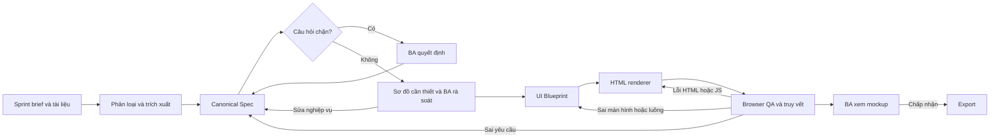

# Workflow cho một sprint

| Bước | Đầu ra | Điều kiện qua bước |
|---|---|---|
| Nhận đầu vào | Sprint brief, file nguồn, source ID và vị trí trích dẫn | Biết phạm vi sprint và phần liên quan UI web |
| Chuẩn hóa | `canonical-spec.json` | Requirement có ID, trạng thái, nguồn; mâu thuẫn/thiếu sót được ghi rõ |
| BA review | `review-decisions.md` | Không còn câu hỏi chặn về quyền, luồng chính, dữ liệu bắt buộc, phép tính quan trọng |
| Sơ đồ tùy chọn | Source và ảnh/link render | BA xác nhận nội dung khớp Spec; sửa Spec nếu phát hiện sai |
| Lập UI | `ui-blueprint.json` | Screen, action, flow, state liên kết requirement ID; liệt kê yêu cầu chưa map |
| Render | HTML/CSS/JS, dữ liệu giả | Bấm được luồng trong phạm vi sprint, không phụ thuộc backend thật |
| QA và BA xem | Coverage, issues, screenshots, quyết định | Không có lỗi nghiệp vụ nghiêm trọng và luồng chính chạy được |

## Quy tắc quyết định

- **Chặn:** mâu thuẫn về phân quyền, nhánh chính, dữ liệu bắt buộc, quy tắc tính toán ảnh hưởng kết quả.
- **Đi tiếp có nhãn:** thiếu màu sắc, copy, dữ liệu giả, thứ tự trường ít ảnh hưởng; ghi `assumptions`.
- **Ngoài phạm vi HTML:** backend, tích hợp thật, hạ tầng; ghi `outOfScope`, mô phỏng UI liên quan.
- **Nhiều nguồn mâu thuẫn:** ghi cả hai nguồn và để BA chọn nguồn hiệu lực; không tự chọn bản mới nhất.

## Truy vết và vòng sửa

QA kiểm hai chiều: yêu cầu UI chưa được thể hiện; thành phần/hành vi UI không có căn cứ trong Spec. Khi BA sửa nghiệp vụ, cập nhật Canonical Spec, sau đó sơ đồ và Blueprint liên quan, cuối cùng render lại HTML. Không sửa HTML để che lỗi trong Spec.

## Definition of done cho POC

- Một sprint thật có 2–5 màn hình và một luồng bấm xuyên suốt.
- Mỗi yêu cầu UI mức `must` được map hoặc có lý do chưa map.
- Không có quy tắc nghiệp vụ trong HTML mà thiếu trong Canonical Spec.
- Form có trạng thái mặc định, lỗi xác thực và thành công; list có empty state khi phù hợp.
- Prototype chạy ở 375px và desktop, không lỗi JS console trong luồng chính.
- BA đã xem các câu hỏi chặn và lỗi nghiệp vụ nghiêm trọng.
