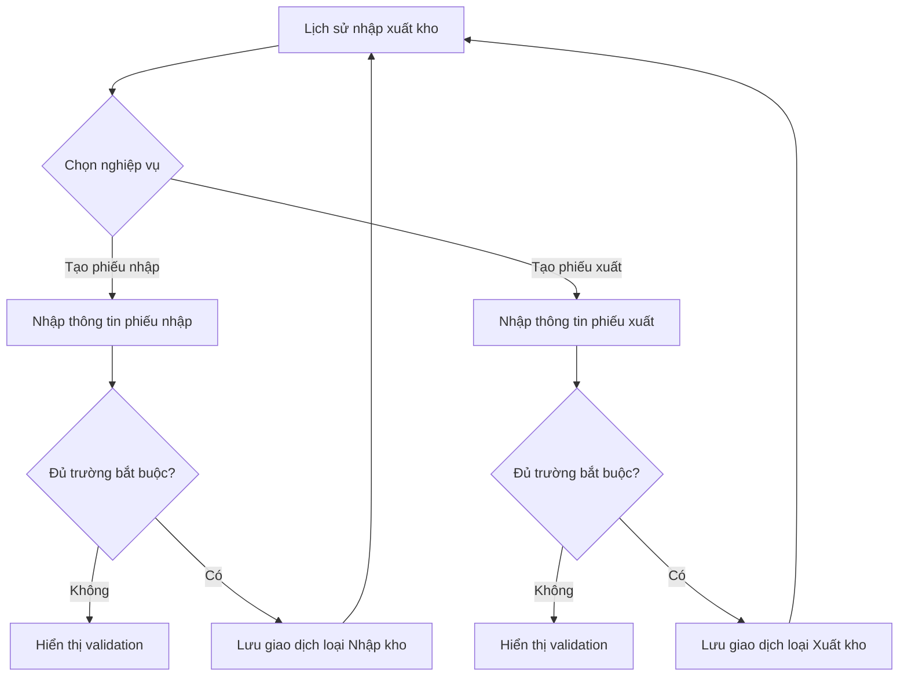

# Luồng quản lý kho mẫu — INV-DEMO-01

## Phạm vi demo

Vai trò duy nhất là **Nhân viên kho**. Prototype cho phép xem lịch sử giao dịch, tạo phiếu nhập và tạo phiếu xuất. Dữ liệu được lưu cục bộ trong trình duyệt để người xem thử luồng; không kết nối ERP hoặc cơ sở dữ liệu thật.

## Luồng chính

## Màn hình 1 — Lịch sử nhập xuất kho

Hiển thị bảng gồm loại giao dịch, ngày chứng từ, mã hàng, tên hàng, kho và số lượng. Khi chưa có dữ liệu, hiển thị trạng thái trống. Hai hành động chính:

- **Tạo phiếu nhập** → chuyển sang màn hình nhập kho.
- **Tạo phiếu xuất** → chuyển sang màn hình xuất kho.

## Màn hình 2 — Tạo phiếu nhập kho

Các trường bắt buộc: ngày chứng từ, mã hàng, tên hàng, kho và số lượng. Khi lưu thành công, prototype thêm bản ghi với loại `Nhập kho` rồi quay về lịch sử.

## Màn hình 3 — Tạo phiếu xuất kho

Các trường bắt buộc giống phiếu nhập. Khi lưu thành công, prototype thêm bản ghi với loại `Xuất kho` rồi quay về lịch sử.

## Kịch bản kiểm thử thủ công

1. Mở `output/index.html`; xác nhận trạng thái chưa có dữ liệu.
2. Bấm **Tạo phiếu nhập**, để trống một trường rồi bấm lưu; xác nhận trình duyệt chặn gửi.
3. Điền một phiếu nhập hợp lệ; xác nhận giao dịch xuất hiện trong lịch sử với loại `Nhập kho`.
4. Tạo một phiếu xuất hợp lệ; xác nhận giao dịch xuất hiện với loại `Xuất kho`.
5. Tải lại trang; xác nhận dữ liệu demo vẫn còn trong cùng trình duyệt.

## Chưa được xem là nghiệp vụ đã chốt

- Có cho phép xuất vượt tồn khả dụng không.
- Có cần phê duyệt phiếu nhập/xuất không.
- Có quản lý lô, serial, hạn sử dụng hoặc vị trí bin không.
- Cách tính tồn theo thời điểm, đơn vị quy đổi và giao dịch hủy/đảo.

Những điểm này đang nằm trong `review-decisions.md` và phải được BA xác nhận trước khi dùng Spec cho triển khai thật.
